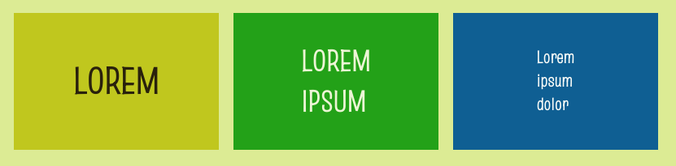

Tu peux utiliser des balises de titre (`<h1>`, `<h2>` et `<h3>`) pour créer de grands titres de texte dans des tuiles colorées.



## --- code ---

language: html
filename: index.html
line_numbers: false
--------------------------------------------------------

<main class="page">
    <section class="wrap">
        <div class="primary tile">
          <h1>LOREM</h1>
        </div>

```
    <div class="secondary tile">
      <h2>LOREM<br>IPSUM</h2>
    </div>

    <div class="tertiary tile">
        <h3>Lorem<br>ipsum<br>dolor</h3>
    </div>
</section>
```

</main>

\--- /code ---

Utilise la classe `tile` pour t'assurer que tes tuiles ont toutes la même hauteur.

**Astuce :** tu peux ajuster la `hauteur` de la classe `tile` dans `style.css`.
