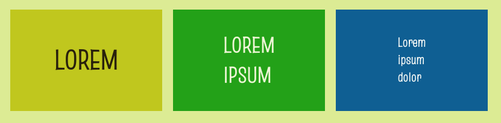

Je kunt 'heading' tags (`<h1>`, `<h2>` en `<h3>`) gebruiken om grote tekstkoppen in gekleurde tegels te maken.



## --- code ---

language: html
filename: index.html
line_numbers: false
--------------------------------------------------------

<main class="page">
    <section class="wrap">
        <div class="primary tile">
          <h1>LOREM</h1>
        </div>

```
    <div class="secondary tile">
      <h2>LOREM<br>IPSUM</h2>
    </div>

    <div class="tertiary tile">
        <h3>Lorem<br>ipsum<br>dolor</h3>
    </div>
</section>
```

</main>

\--- /code ---

Gebruik de class `tile` om ervoor te zorgen dat jouw tegels allemaal dezelfde hoogte hebben.

**Tip:** Je kunt de `height` (hoogte) van de `tile` (tegel) class aanpassen in `style.css`.
