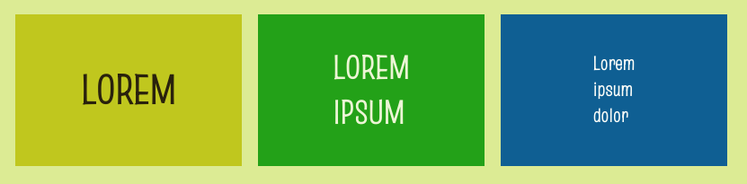

你可以使用标题标签（`<0>`, `<1>`,，和 `<2>`）在彩色块上创建大文本标题。



## --- code ---

language: html
filename: index.html
line_numbers: false
--------------------------------------------------------

<main class="page">
    <section class="wrap">
        <div class="primary tile">
          <h1>LOREM</h1>
        </div>

```
    <div class="secondary tile">
      <h2>LOREM<br>IPSUM</h2>
    </div>

    <div class="tertiary tile">
        <h3>Lorem<br>ipsum<br>dolor</h3>
    </div>
</section>
```

</main>

\--- /code ---

使用 `tile` 类来确保你的块是相同的高度。

\*\*提示：\*\*你可以在 `style.css` 中调整 `tile` 类的 `height` 。
